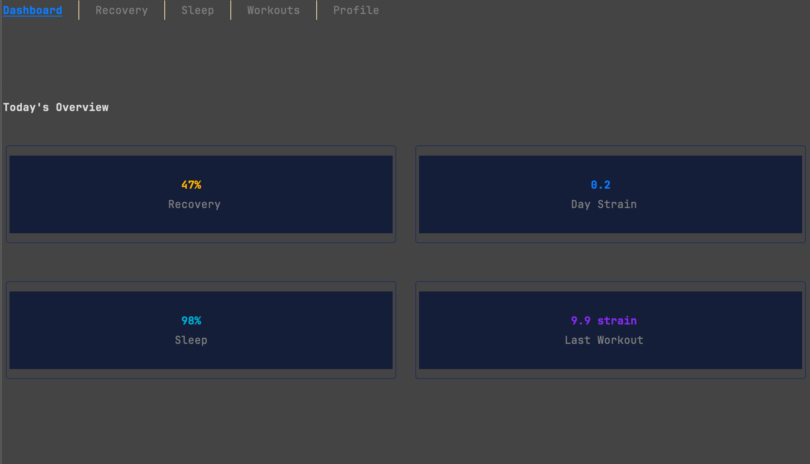
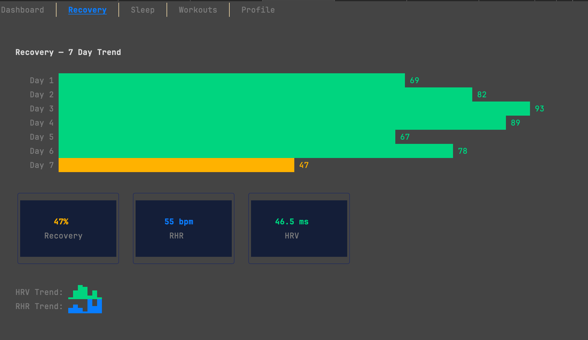
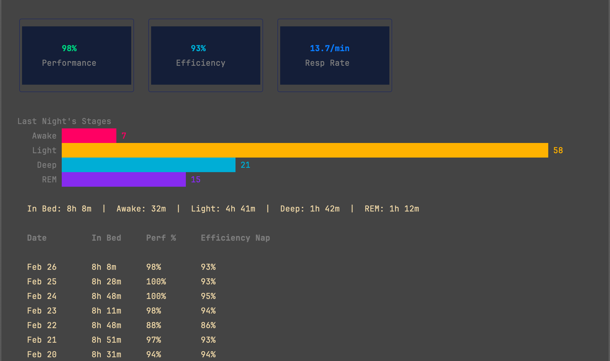

# whoop-cli

A terminal client for viewing your [WHOOP](https://www.whoop.com/) health data. Includes both a CLI and an interactive TUI.

<!-- TUI Screenshots -->

### Dashboard

> 

### Recovery

> 

### Sleep

> 

---

## Quick Start

1. [Create a WHOOP Developer app](#create-a-whoop-developer-application)
2. [Install](#install) the `whoop` binary
3. Set your credentials:
   ```bash
   export WHOOP_CLIENT_ID="your_client_id"
   export WHOOP_CLIENT_SECRET="your_client_secret"
   ```
4. Log in:
   ```bash
   whoop login
   ```
5. Launch the TUI:
   ```bash
   whoop
   ```

## Create a WHOOP Developer Application

whoop-cli uses the WHOOP API via OAuth 2.0. You'll need to register your own application to get API credentials.

1. Go to the [WHOOP Developer Dashboard](https://developer-dashboard.whoop.com) and sign in with your WHOOP account.
2. Create a **Team** if you haven't already (you'll be prompted).
3. Click [Create App](https://developer-dashboard.whoop.com/apps/create).
4. Fill in the application details:
   - **App Name** — anything you like, e.g. `whoop-cli`
   - **Redirect URI** — must be exactly: `http://localhost:8080/callback`
   - **Scopes** — select all of the following:
     - `read:body_measurement`
     - `read:cycles`
     - `read:recovery`
     - `read:sleep`
     - `read:workout`
     - `offline` (required for token refresh)
5. After creating the app, note your **Client ID** and **Client Secret**.

> **Important:** Keep your Client Secret private. Never commit it to version control or share it publicly.

## Install

### With Go

If you have Go installed:

```bash
go install github.com/lornest/whoop-cli/cmd/whoop@latest
```

This places the `whoop` binary in your `$GOPATH/bin`. Make sure that's on your `PATH`.

### From source

```bash
git clone https://github.com/lornest/whoop-cli.git
cd whoop-cli
make install
```

## Setup

Add your WHOOP app credentials to your shell profile (`~/.zshrc`, `~/.bashrc`, etc.):

```bash
export WHOOP_CLIENT_ID="your_client_id"
export WHOOP_CLIENT_SECRET="your_client_secret"
```

Then authenticate:

```bash
whoop login
```

This opens your browser to authorize the app. After you approve, tokens are stored securely in your OS keychain (macOS Keychain, Linux Secret Service, Windows Credential Manager) and refreshed automatically. You should only need to log in once.

## Usage

### Interactive TUI

Run `whoop` with no arguments to launch the terminal UI:

```bash
whoop
```

| Key | Action |
|---|---|
| `Tab` / `Shift+Tab` | Next / previous tab |
| `1`–`5` | Jump to tab |
| `j` / `k` | Scroll (workouts list) |
| `r` | Refresh data |
| `q` | Quit |

### CLI Commands

```bash
whoop recovery    # Recovery scores
whoop sleep       # Sleep data
whoop workouts    # Workouts
whoop cycles      # Physiological cycles
whoop profile     # Body measurements
```

### Flags

| Flag | Default | Description |
|---|---|---|
| `--format` | `table` | Output format: `table`, `json`, or `text` |
| `--days` | `7` | Number of days of data to fetch |

Examples:

```bash
whoop recovery --days 14 --format json
whoop sleep --format text
whoop workouts --days 30
```

## Development

```bash
make build    # Build ./whoop-cli binary locally
make install  # Install to $GOPATH/bin
make test     # Run all tests
make lint     # Run golangci-lint
make cover    # Generate HTML coverage report
make clean    # Remove binary and test cache
```

## License

MIT
